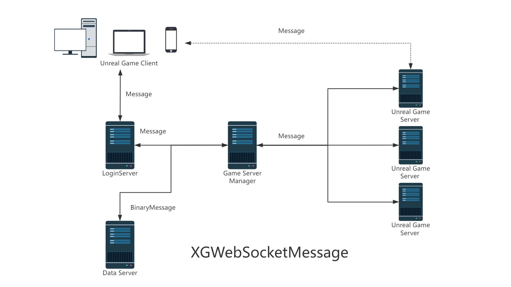
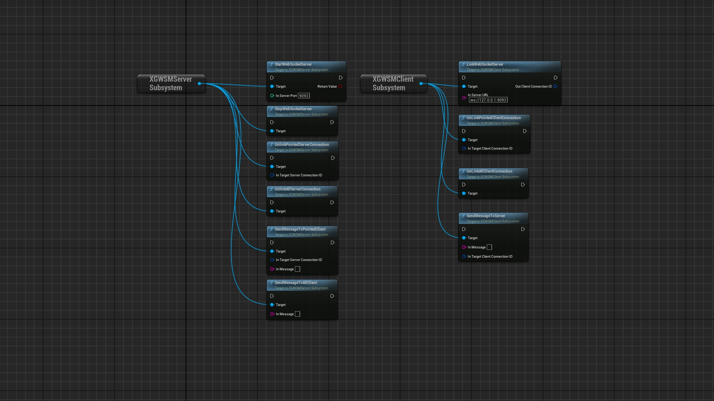
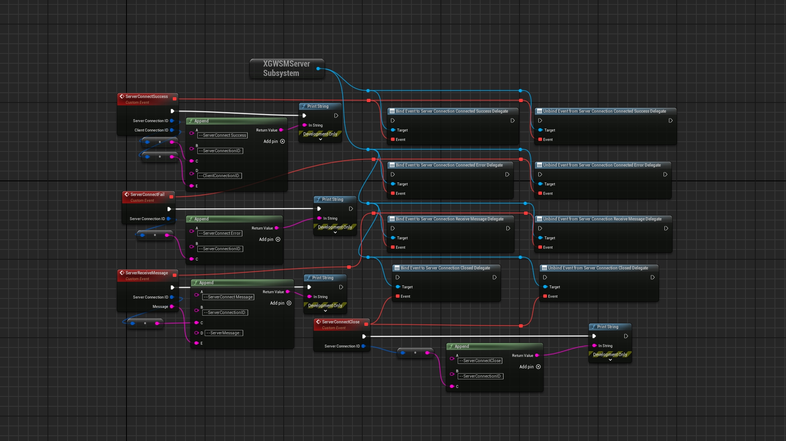
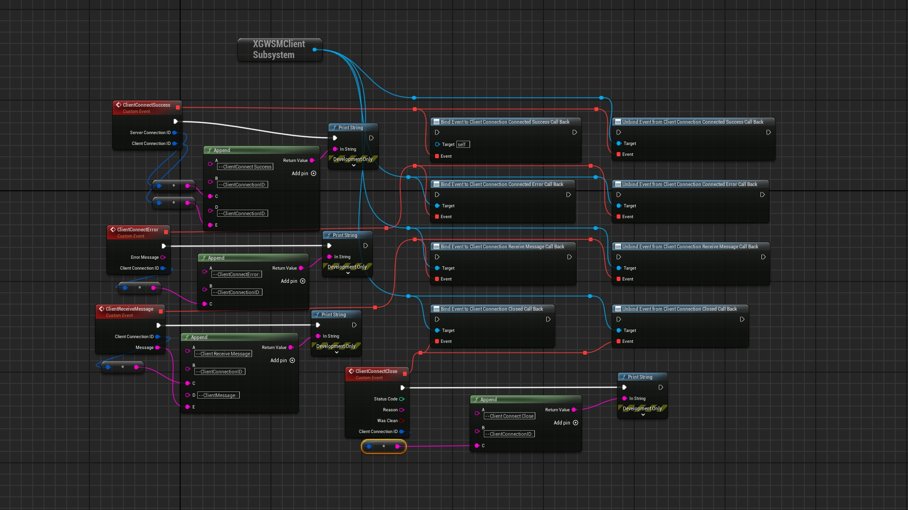

# XGWebSocketMessage
Plugin Version:2.1 </br> 

  
- [XGWebSocketMessage](#xgwebsocketmessage)
	- [Brief](#brief)
	- [Use process](#use-process)
	- [Function entry](#function-entry)
	- [Server-side](#server-side)
		- [Binding agents](#binding-agents)
		- [Start the server](#start-the-server)
		- [Stop the server](#stop-the-server)
		- [Close the connection](#close-the-connection)
		- [Send the message](#send-the-message)
	- [Client-side](#client-side)
		- [Binding agents](#binding-agents-1)
		- [Start the connection](#start-the-connection)
		- [Close the connection](#close-the-connection-1)
		- [Send Message](#send-message)
	- [Sample Project](#sample-project)
	- [Communication structure](#communication-structure)
	- [Heartbeat mechanism](#heartbeat-mechanism)
	- [Package](#package)
	- [Contact Information](#contact-information)

## Brief

&emsp;&emsp;XGWebSocketMessage is an Unreal Engine 5 plugin that allows you to communicate between Unreal projects (clients, listening servers, dedicated servers, standalones). It is developed based on the built-in WebSocket and WebSocketServer of UE5, with both server and client.  
&emsp;&emsp;It is highly recommended that you use both the server side and the client side of the plugin. If you use the server or client separately, then you must comply with the communication structure protocol and heartbeat mechanism of the plugin.  
&emsp;&emsp;Depending on your usage, you may need a public IP and open the corresponding port.  
&emsp;&emsp;Plugin URL:  
&emsp;&emsp;&emsp;&emsp;[XGWebSocketMessage](https://www.unrealengine.com/marketplace/zh-CN/product/xgwebsocketmessage);  
&emsp;&emsp;Sample project download URL:  
&emsp;&emsp;&emsp;&emsp;[XGWebSocketMessageDemo](https://github.com/liuhuagang/XGWebSocketMessage/tree/main/BPDemo/XGWebSocketDemo);  You need to download and install the plug-in to successfully open the demo
&emsp;&emsp;English description:  
&emsp;&emsp;&emsp;&emsp;[README](./README.md)  
&emsp;&emsp;Chinese description:  
&emsp;&emsp;&emsp;&emsp;[中文说明书](./README_CN.md)  

Attention:
1. The plugin only uses the code provided by Unreal Engine 5, with no other dependencies;
2. The plugin does not collect any information and sends it to the plugin author;
  
## Use process
a. Start the server</br>
b. Wait for the client to connect</br>
c. Connect to client 1</br>
d. The server communicates with client 1</br>
e. Connect to client 2</br>
f. The server communicates with client 2</br>
...</br>
g. Client 1 Closes the connection</br>
...</br>
h. The server closes all connections</br>
i. The server exits</br>
## Function entry  

  

## Server-side
### Binding agents
&emsp;&emsp;You should bind the proxy before starting the server, and all the messages received by the server will be sent from this point.  

  

ConnectSucceessDelegate:The agent that successfully connected, and that connection can communicate</br>
ConnectErrorDelegate:An agent that fails to connect, and the connection is unavailable</br>
RecevieMessageDelegate:Received information agent.</br>
CloseDelegate:The proxy when the connection is closed.</br>
### Start the server  
```
    UFUNCTION(BlueprintCallable, meta = (DisplayName = "StartWebSocketServer", Keywords = "XG Web Socket Message WSM Server Start"), Category = "XGWebSocketMessage|SocketServer")
	bool StartWebSocketServer(int32 InServerPort);

```
&emsp;&emsp;You need to specify the port through which to start the server. If the port is occupied, the startup fails  
### Stop the server  
```
	UFUNCTION(BlueprintCallable, meta = (DisplayName = "StopWebSocketServer", Keywords = "XG Web Socket Message WSM Stop"), Category = "XGWebSocketMessage|SocketServer")
	void StopWebSocketServer();
```
&emsp;&emsp;You can turn off the server when you no longer use it.   
### Close the connection  
&emsp;&emsp;You can close specific client connections or all client connections  
```
	UFUNCTION(BlueprintCallable, meta = (DisplayName = "UnlinkPointedServerConnection", 
	Keywords = "XG Web Socket Message WSM Unlink Pointed Client Connection"), Category = "XGWebSocketMessage|SocketServer")
	void UnlinkPointedServerConnection(FGuid InTargetServerConnectionID);

	UFUNCTION(BlueprintCallable, meta = (DisplayName = "UnlinkAllServerConnection", 
	Keywords = "XG Web Socket Message WSM Unlink  All Client Connection"), Category = "XGWebSocketMessage|SocketServer")
	void UnlinkAllServerConnection();
```
### Send the message
&emsp;&emsp;You can send a specified message to a specified client connection or to all clients
```
	UFUNCTION(BlueprintCallable, meta = (DisplayName = "SendMessageToAllClient", 
	Keywords = "XG Web Socket Message WSM Send All Client"), Category = "XGWebSocketMessage|SocketServer")
	void SendMessageToAllClient(FString InMessage);

	UFUNCTION(BlueprintCallable, meta = (DisplayName = "SendMessageToPointedClient",
	Keywords = "XG Web Socket Message WSM Send Pointed Client"), Category = "XGWebSocketMessage|SocketServer")
	void SendMessageToPointedClient(FGuid InTargetServerConnectionID, FString InMessage);
```  
## Client-side
### Binding agents
&emsp;&emsp;You should bind the proxy before you start connecting to the server, and all the messages received by the server will be sent from this point.  

  

ConnectSucceessDelegate:The agent that successfully connected, and that connection can communicate</br>
ConnectErrorDelegate:An agent that fails to connect, and the connection is unavailable</br>
RecevieMessageDelegate:Received information agent.</br>
CloseDelegate:The proxy when the connection is closed.</br>

### Start the connection  
&emsp;&emsp; You can connect to an already enabled server by entering the server's IP address and port
```
	UFUNCTION(BlueprintCallable, meta = (DisplayName = "LinkWebSocketServer", KeyWords = "XG Web Socket Message WSM Link Client Server"), Category = "XGWebSocketMessage|SocketClient")
	void LinkSocketServer(const FString& InServerURL, /*const FString& InServerProtocol, TMap<FString, FString> InServerUpgradeHeaders,*/ FGuid& OutClientConnectionID);

```
### Close the connection
&emsp;&emsp; you can close the specified connection or all connections  

```
	UFUNCTION(BlueprintCallable, meta = (DisplayName = "UnLinkPointedClientConnection", KeyWords = "XG Web Socket Message WSM Unlink Client Connection Server Pointed"), Category = "XGWebSocketMessage|SocketClient")
	void UnLinkPointedClientConnection(const FGuid& InTargetClientConnectionID);

	UFUNCTION(BlueprintCallable, meta = (DisplayName = "UnLinkAllClientConnection", KeyWords = "XG Web Socket Message WSM Unlink Client Connection Server"), Category = "XGWebSocketMessage|SocketClient")
	void UnLinkAllClientConnection();
```
### Send Message   

&emsp;&emsp; You can send information to the server through the specified client connection


```
	UFUNCTION(BlueprintCallable, meta = (DisplayName = "SendMessageToServer", KeyWords = "XG Web Socket Message WSM Send Client Server"), Category = "XGWebSocketMessage|SocketClient")
	void SendMessageToServer(const FString& InMessage, const FGuid& InTargetClientConnectionID);
```
## Sample Project  

You can get the XGWebSocketMessage plugin and download the sample project code directly for testing

  


## Communication structure

If you need to customize the server or client, please refer to the following communication structure, and the client establishes the connection for the first time to send the client connection ID to the server, and the server will return the server connection ID to the client connection. The client connection ID and server connection ID are unique and paired.

```
UENUM()
enum class EXGWSMActionType : uint8
{
	None,
	ClientCallServerInit,
	ServerResponseClientInit,
	ClientCallTick,
	ServerResponseTick,
	ClientMessageToServer,
	ServerMessageToClient,
	ClientReqQuit,
	ServerAllowClientQuit,
	ServerReqQuit,
	ClientAllowServerQuit,

	Max,

};


USTRUCT()
struct  FXGWSMMessage
{

	GENERATED_USTRUCT_BODY()

public:

	UPROPERTY()
	int32 Code = -1;

	UPROPERTY()
	EXGWSMActionType Action = EXGWSMActionType::None;

	UPROPERTY()
	FGuid ClientConnectionID ;

	UPROPERTY()
	FGuid ServerConnectionID ;

	UPROPERTY()
	FString Description = TEXT("");

	UPROPERTY()
	FString Data = TEXT("");

};


```

## Heartbeat mechanism
The Plugin have been implemented:
1.The connection times out after 10 seconds, and the server or client determines that the connection is unavailable
2.Every 3 seconds, a heartbeat communication occurs.

## Package
&emsp;&emsp;Windows & Andriod:[5.3-5.5].<br>
&emsp;&emsp;The server interface is only callable on Windows<br>

## Contact Information    

Please contact me if you have any questions about [XGWebSocketMessage](https://www.unrealengine.com/marketplace/zh-CN/product/xgwebsocketmessage).

QQ:
709777172  

Email:
709777172@qq.com  

bilibili:
[虚幻小刚](https://space.bilibili.com/8383085)  

