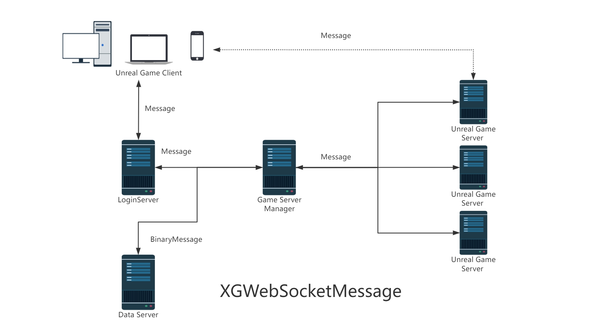
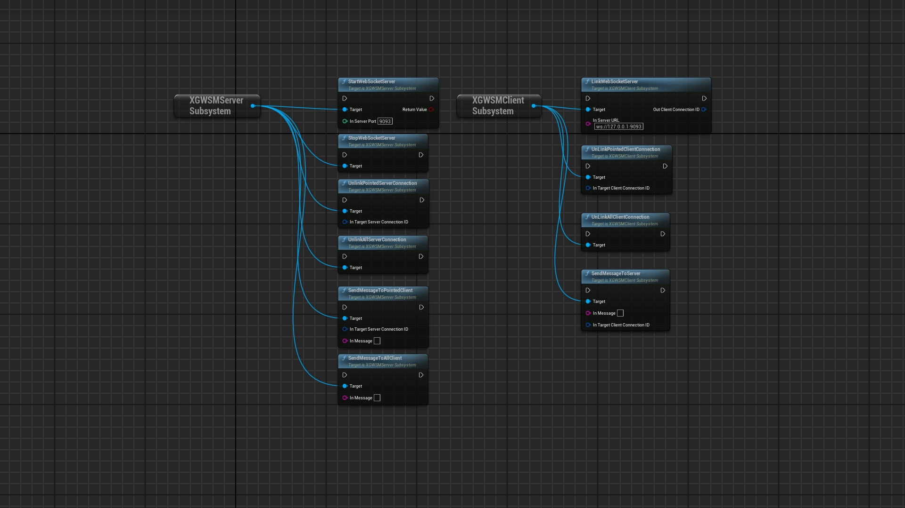
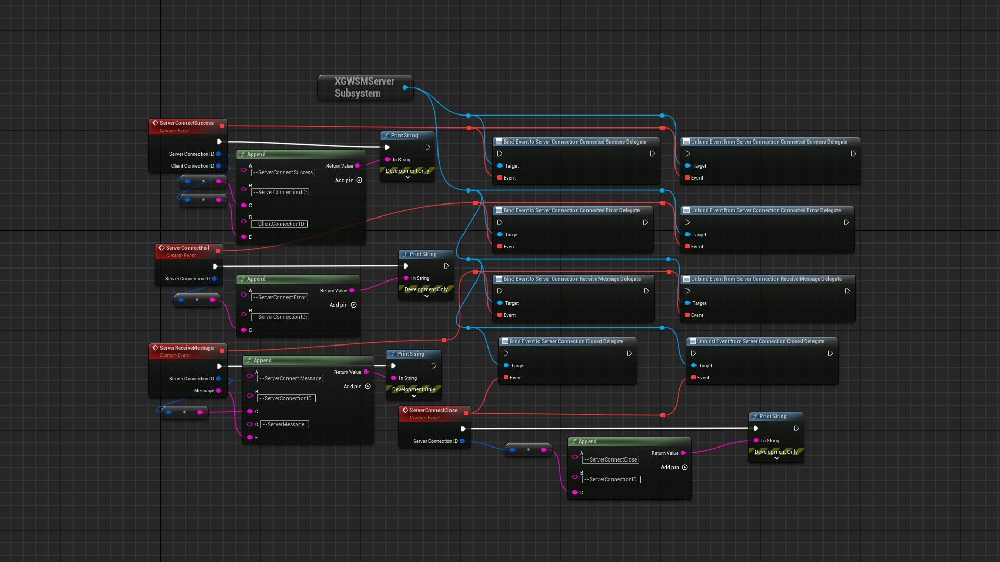
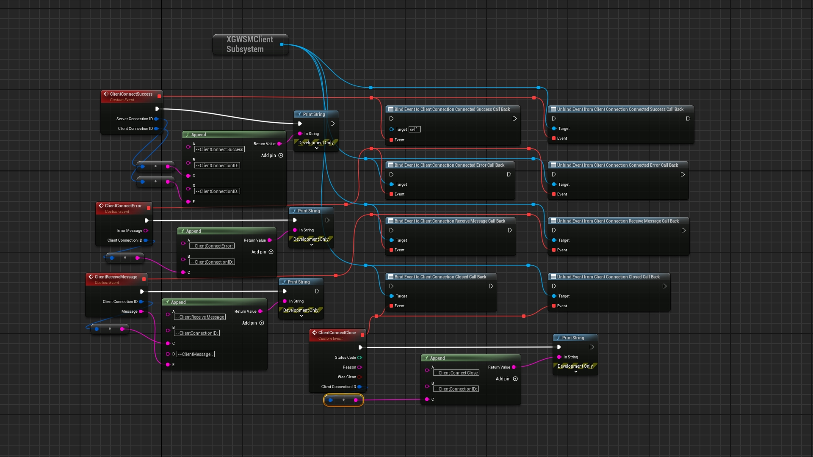
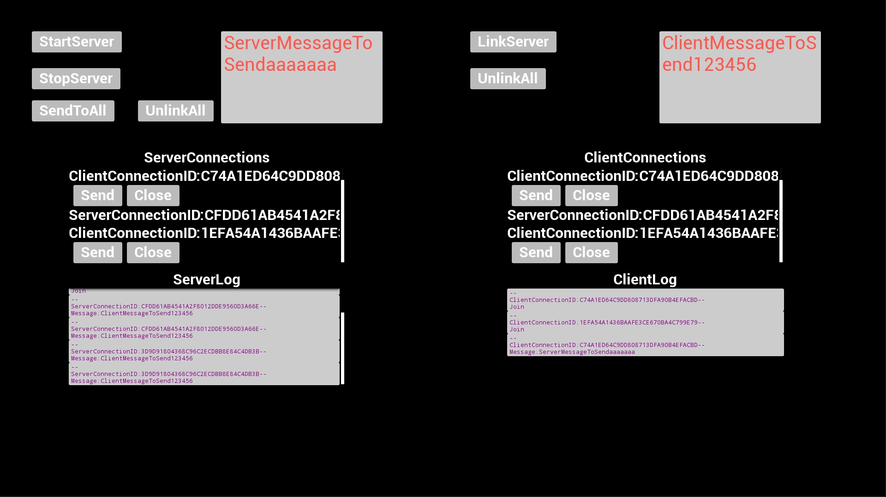

# XGWebSocketMessage
版本:2.1</br>
  
- [XGWebSocketMessage](#xgwebsocketmessage)
	- [简介](#简介)
	- [使用流程](#使用流程)
	- [函数速览](#函数速览)
	- [服务端](#服务端)
		- [绑定代理](#绑定代理)
		- [开启服务器](#开启服务器)
		- [关闭服务器](#关闭服务器)
		- [关闭连接](#关闭连接)
		- [发送信息](#发送信息)
	- [客户端](#客户端)
		- [绑定代理](#绑定代理-1)
		- [开启连接](#开启连接)
		- [关闭连接](#关闭连接-1)
		- [发送信息](#发送信息-1)
	- [示例项目](#示例项目)
	- [通讯结构体](#通讯结构体)
	- [心跳机制](#心跳机制)
	- [打包](#打包)
	- [联系方式](#联系方式)

## 简介

&emsp;&emsp;XGWebSocketMessage 是一款虚幻引擎5插件,它支持你在虚幻项目(客户端,聆听服务器,专属服务器,单例游戏)之间相互通信.它是基于UE5内置的WebSocket和WebSocketServer进行开发的,同时具备服务端和客户端.  
&emsp;&emsp;强烈建议你同时使用该插件的服务端和客户端.如果你单独使用服务端或客户端,那么你必须遵守该插件的通讯结构协议及心跳机制.  
&emsp;&emsp;根据你的使用情况,你可能需要公网IP并开放相应的端口.  
&emsp;&emsp;FAB商城插件地址:  
&emsp;&emsp;&emsp;&emsp;[XGWebSocketMessage](https://www.fab.com/zh-cn/listings/17f3be65-ceb5-4da0-b546-161e7e75012d);  
&emsp;&emsp;示例项目下载:  
&emsp;&emsp;&emsp;&emsp;[XGWebSocketMessageDemo](https://github.com/liuhuagang/XGWebSocketMessage/tree/main/BPDemo/XGWebSocketDemo);你需要先下载安装插件才能顺利打开demo</br>
&emsp;&emsp;英文说明:  
&emsp;&emsp;&emsp;&emsp;[README](./README.md)  
&emsp;&emsp;中文说明:  
&emsp;&emsp;&emsp;&emsp;[中文说明书](./README_CN.md)  

注意:  
1.该插件仅使用了虚幻引擎5提供的代码,不含其他依赖;  
2.该插件不会收集任何信息并将其发送给插件作者; 

## 使用流程
a.开启服务器  
b.等待客户端接入  
c.客户端1进行连接  
d.服务器和客户端1进行通信  
e.客户端2进行连接  
f.服务器和客户端2进行通信  
......  
g.客户端1通信完毕关闭连接  
......  
h.服务器关闭所有连接  
i.服务器退出
## 函数速览
  
## 服务端
### 绑定代理
&emsp;&emsp;你应当在启动服务器前绑定好代理,所有服务器收到的连接信息都将统一从此处分发.  

  

ConnectSucceessDelegate:连接成功的代理,该连接可以进行通信  

ConnectErrorDelegate:连接失败的代理,该连接为不可用  

RecevieMessageDelegate:收到的信息代理  

CloseDelegate:该连接关闭时的代理  

### 开启服务器  
```
    UFUNCTION(BlueprintCallable, meta = (DisplayName = "StartWebSocketServer", Keywords = "XG Web Socket Message WSM Server Start"), Category = "XGWebSocketMessage|SocketServer")
	bool StartWebSocketServer(int32 InServerPort);

```
&emsp;&emsp;你需要指定通过哪一个端口开启本服务器,端口被占用会导致启动失败  
### 关闭服务器  
```
	UFUNCTION(BlueprintCallable, meta = (DisplayName = "StopWebSocketServer", Keywords = "XG Web Socket Message WSM Stop"), Category = "XGWebSocketMessage|SocketServer")
	void StopWebSocketServer();
```
&emsp;&emsp;当你不再使用时,可以关闭该服务器.   
### 关闭连接  
&emsp;&emsp;你可以关闭指定的客户端连接或者所有的客户端连接  
```
	UFUNCTION(BlueprintCallable, meta = (DisplayName = "UnlinkPointedServerConnection", 
	Keywords = "XG Web Socket Message WSM Unlink Pointed Client Connection"), Category = "XGWebSocketMessage|SocketServer")
	void UnlinkPointedServerConnection(FGuid InTargetServerConnectionID);

	UFUNCTION(BlueprintCallable, meta = (DisplayName = "UnlinkAllServerConnection", 
	Keywords = "XG Web Socket Message WSM Unlink  All Client Connection"), Category = "XGWebSocketMessage|SocketServer")
	void UnlinkAllServerConnection();
```
### 发送信息
&emsp;&emsp;你可以发送指定的信息给指定的客户端连接或者所有的客户端
```
	UFUNCTION(BlueprintCallable, meta = (DisplayName = "SendMessageToAllClient", 
	Keywords = "XG Web Socket Message WSM Send All Client"), Category = "XGWebSocketMessage|SocketServer")
	void SendMessageToAllClient(FString InMessage);

	UFUNCTION(BlueprintCallable, meta = (DisplayName = "SendMessageToPointedClient",
	Keywords = "XG Web Socket Message WSM Send Pointed Client"), Category = "XGWebSocketMessage|SocketServer")
	void SendMessageToPointedClient(FGuid InTargetServerConnectionID, FString InMessage);
```  
## 客户端
### 绑定代理
&emsp;&emsp;你应当在开始连接服务器前绑定好代理,所有服务器收到的连接信息都将统一从此处分发.  

  

ConnectSucceessDelegate:连接成功的代理,该连接可以进行通信  

ConnectErrorDelegate:连接失败的代理,该连接为不可用  

RecevieMessageDelegate:收到的信息代理  

CloseDelegate:该连接关闭时的代理  

### 开启连接  
&emsp;&emsp; 你可以连接到已经开启的服务器,需要输入该服务器的IP地址和端口
```
	UFUNCTION(BlueprintCallable, meta = (DisplayName = "LinkWebSocketServer", KeyWords = "XG Web Socket Message WSM Link Client Server"), Category = "XGWebSocketMessage|SocketClient")
	void LinkSocketServer(const FString& InServerURL, /*const FString& InServerProtocol, TMap<FString, FString> InServerUpgradeHeaders,*/ FGuid& OutClientConnectionID);

```
### 关闭连接
&emsp;&emsp; 你可以关闭指定的连接或者所有的连接  

```
	UFUNCTION(BlueprintCallable, meta = (DisplayName = "UnLinkPointedClientConnection", KeyWords = "XG Web Socket Message WSM Unlink Client Connection Server Pointed"), Category = "XGWebSocketMessage|SocketClient")
	void UnLinkPointedClientConnection(const FGuid& InTargetClientConnectionID);

	UFUNCTION(BlueprintCallable, meta = (DisplayName = "UnLinkAllClientConnection", KeyWords = "XG Web Socket Message WSM Unlink Client Connection Server"), Category = "XGWebSocketMessage|SocketClient")
	void UnLinkAllClientConnection();
```
### 发送信息   

&emsp;&emsp; 你可以通过指定的客户端连接发送信息到服务器

```
	UFUNCTION(BlueprintCallable, meta = (DisplayName = "SendMessageToServer", KeyWords = "XG Web Socket Message WSM Send Client Server"), Category = "XGWebSocketMessage|SocketClient")
	void SendMessageToServer(const FString& InMessage, const FGuid& InTargetClientConnectionID);
```
## 示例项目  

你可以在获得XGWebSocketMessage插件后,直接下载示例工程代码进行测试

  


## 通讯结构体  

如果你需要自定义服务器或客户端,请参考以下通信结构体,并在客户端第一次建立连接发送客户端的连接给服务器,服务器会返回服务端连接ID给该客户端连接.客户端连接和服务器连接ID具有唯一性,且配对.

```
UENUM()
enum class EXGWSMActionType : uint8
{
	None,
	ClientCallServerInit,
	ServerResponseClientInit,
	ClientCallTick,
	ServerResponseTick,
	ClientMessageToServer,
	ServerMessageToClient,
	ClientReqQuit,
	ServerAllowClientQuit,
	ServerReqQuit,
	ClientAllowServerQuit,

	Max,

};


USTRUCT()
struct  FXGWSMMessage
{

	GENERATED_USTRUCT_BODY()

public:

	UPROPERTY()
	int32 Code = -1;

	UPROPERTY()
	EXGWSMActionType Action = EXGWSMActionType::None;

	UPROPERTY()
	FGuid ClientConnectionID ;

	UPROPERTY()
	FGuid ServerConnectionID ;

	UPROPERTY()
	FString Description = TEXT("");

	UPROPERTY()
	FString Data = TEXT("");

};


```

## 心跳机制
插件已实现:
超过10秒后认为连接超时,该连接会被服务器或者客户端判定为不可用  
每隔3秒,会进行一次心跳通信.

## 打包
&emsp;&emsp;Windows & Andriod:[5.3-5.5].<br>
&emsp;&emsp;服务器接口仅在Windows上可调用<br>

## 联系方式  
如果有任何[XGWebSocketMessage](https://www.fab.com/zh-cn/listings/17f3be65-ceb5-4da0-b546-161e7e75012d)插件产品问题,请联系我.  

QQ:
709777172  

Email:
709777172@qq.com  

bilibili:
[虚幻小刚](https://space.bilibili.com/8383085)  

